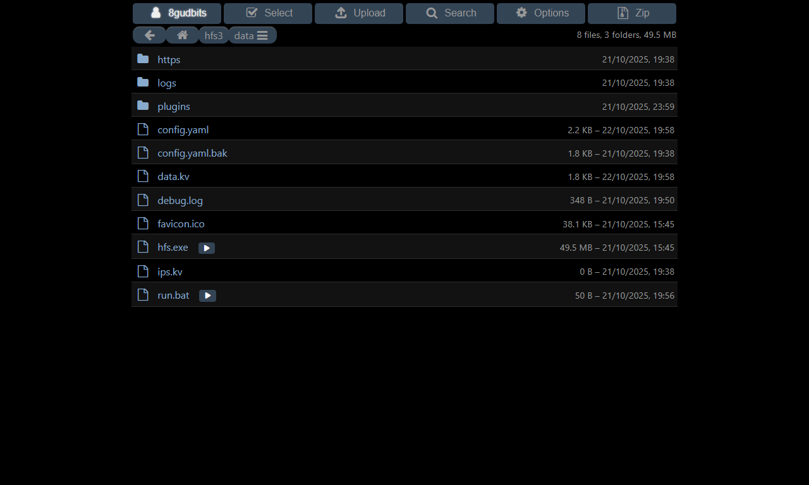

# hfs-run-files

Run executable files on the server (Windows only) using hfs.

## Features

- Adds run buttons next to executable files in HFS file listings
- Executes files directly on the server (not the client's computer)
- Supports various file types: `.exe`, `.msi`, `.bat`, `.cmd`, `.ps1`, `.vbs`, and more
- Configurable file extensions

## Manual Installation

1. Download the plugin's `dist` folder
2. Place it in your HFS `plugins` directory
3. Refresh HFS admin page

## Configuration

In the HFS admin panel under Plugins > hfs-run:

- **Show run button**: Enable/disable the run button display
- **File extensions**: Customize which file extensions show the run button (separated by `|`)
- **Users/groups who can see run buttons**: Restrict run button visibility to specific users or groups (leave empty to show to all users)

**Default extensions**: `exe|msi|bat|ps1|vbs`

## Supported File Types

- **.exe** - Executable files (runs directly)
- **.msi** - Windows installer packages (uses msiexec)
- **.bat/.cmd** - Batch files (uses cmd.exe)
- **.ps1** - PowerShell scripts (uses PowerShell with execution policy bypass)
- **.vbs** - VBScript files (uses wscript.exe through cmd.exe)
- **Plus any other executable file type** configured by the user

## Requirements

- HFS v3 with API version 9.6 or higher
- Windows operating system for the server
- Appropriate permissions to execute files on the server

## Security Notes

⚠️ **Use with caution!** This plugin executes files on your server. Only use with trusted files and in secure environments.

- Files are executed with the same permissions as the HFS process
- Consider running HFS with limited privileges
- Only enable for trusted users or in controlled environments

Note: Run HFS as Admin to allow `.ps1` file execution, Windows does not allow execution of `ps1` files without Admin permits by default.

## Development

To contribute to this plugin:

1. Fork the repository
2. Make your changes
3. Submit a pull request

## Screenshot

## Changelog

### v1.4

- Added real-time backend permission verification on every execution

### v1.3

- Fixed CLI app interference with HFS by using proper process detachment

### v1.2

- Added user/group permissions - admin can now restrict run button visibility to specific users or groups
- Improved security by allowing fine-grained access control

### v1.1

- Fixed file path resolution issue - now properly maps VFS files to real file system paths

### v1.0

- Initial release
- Basic file execution functionality
- Configurable file extensions

